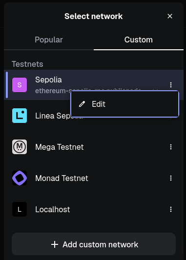

# Freelance Society

Freelance Society is a decentralized free market platform to provide efficient transactions of labor and capital.

[Access Freelance Society Here](https://peterparker303e24.github.io/FreelanceSociety/TheDarkKnight/Frontend/index.html) (Requires blockchain wallet extension such as MetaMask for interactions)

This project is currently built on the Ethereum testnet, Sepolia. This testnet does not require any payment since the Sepolia cryptocurrency can be freely accessed with faucets through websites such as in the link below. Also, a wallet browser extension is required, such as MetaMask, though this is also free to install.

[Get free SepoliaETH here](https://faucetlink.to/sepolia)

## Table Of Contents

[What Is Freelance Society](#what-is-freelance-society)

[Why Use Freelance Society](#why-use-freelance-society)

[How To Setup Frontend Locally](#how-to-setup-frontend-locally)

[How To Setup Blockchain Locally](#how-to-setup-blockchain-locally)

[How To Connect MetaMask To Freelance Society](#how-to-connect-metamask-to-freelance-society)

[Tutorial](https://github.com/peterparker303e24/FreelanceSociety/edit/main/Documentation/Tutorials/CreateUserProfile/CreateUserProfile.md)

[Closing Remarks](#closing-remarks)

## What Is Freelance Society

Freelance Society is a decentralized free market platform to provide efficient transactions of labor and capital.

- **Decentralized**: Blockchains are a decentralized network of nodes that democratize control of transactions. This means there is no centralized authority that has the power to censor transactions, manipulate supply of currency, or invade the privacy of participants. Freelance Society adds a layer of decentralization for labor. The Ethereum blockchain technology has smart contracts that can be utilized to facilitate the transaction of capital and labor. Freelance Society aims to maintain values of existing decentralized technology by eliminating censorship of labor opportunities and respecting users' privacy. Freelance Society is decentralized because it builds upon the decentralized blockchain technology and decentralizes the market of capital providers and workers.
- **Free Market**: A free market system of capital and labor is when capital providers and workers both have the greatest freedom to choose how to spend their resources. Freelance Society provides an improved free market because capital providers have greater opportunity to efficient labor and workers have greater freedom to work opportunities. Additionally, both capital providers and workers have greater freedom of privacy which does not exist in the labor market.
- **Platform**: Freelance Society is a platform to connect users with capital (in search of labor) to workers (in search of capital). Freelance Society aims to connect users through an accesssible interface with tools for all users to optimize the efficiency of their interactions.
- **Efficient Transactions**: Transactions of capital and labor are efficient when the incentive structures in place are optimized for both capital providers and workers. Existing labor markets are failing to provide efficient transactions of labor and capital because those with power are corrupting the market structures to maintain and grow their power. Freelance Society aims to provide efficient transactions by producing incentive structures that provide to users' needs, decentralize power, and outcompete the corrupted market structures. Freelance Society focuses on the transaction of digital goods and services that can be shared throughout the internet. Continue to the section [Why Use Freelance Society](#why-use-freelance-society) to learn how Freelance Society may be beneficial to you whether you are looking for capital or for work. 

## Why Use Freelance Society

Whether you are a user in need of labor or a user searching for work opportunities, Freelance Society allows anyone to participate. Since anybody can participate, the labor pool is competitive, which brings great efficiency. Also, since users can be anonymous, the rewards for workers in completing tasks is based entirely on merit. Users' opportunities for work do not depend on unfair business practices such as discrimination, nepotism, or extensive interview processes. Additionally, workers are free to choose which tasks to spend their time on, choose what compensation they are willing to work towards, and choose how they want to accomplish a task.

Freelance Society is unique among other freelance work platforms because it utilizes features of blockchain technology in advantageous ways. Blockchains are decentralized, so there is no central organization that takes a cut out of transactions. Blockchains are immutable, so the transaction history of all users is fully auditable which incentivizes building trust between users. Blockchains allow users to transact anonymously, so users are able to maintain their freedom of privacy. Blockchains are openly accessible to anyone with an internet connection, so anyone has the opportunity to participate in the free market.

## How To Setup Frontend Locally

You should already have the following dependencies installed on your system, and if you do not already, then you can search online to find out how to install them:
- git
- node
- node package manager

1. Clone this git repository in your desired folder location with the command below.

###
    git clone https://github.com/peterparker303e24/Base.git

2. Go into the Frontend directory.

###
    cd Base/TheDarkKnight/Frontend

3. Install the project dependencies. (ethers.js for blockchain interactions, jszip.js for ZIP file interactions, express.js for initiating a local frontend server, and cookie-parser for handling browser cookies)

###
    npm install

4. Run a local server of the frontend and access the website on localhost with default port 3000 ([http://localhost:3000/](http://localhost:3000/)). The frontend will be configured to target the online Sepolia blockchain by default. Use the parameter `--local-blockchain` to configure the frontend to target a locally running blockchain.

###
    npm run start

or

###
    npm run start-local

- If you want to connect to the Sepolia blockchain, then your frontend setup is complete and you can move on to the section [Connect MetaMask To Sepolia Blockchain](#connect-metamask-to-sepolia-blockchain).

- If you want to instead connect to a locally running blockchain, then complete the steps in the section [How To Setup Blockchain Locally](#how-to-setup-blockchain-locally).

## How To Setup Blockchain Locally

You should already have the following dependencies installed on your system, and if you do not already, then you can search online to find out how to install them:
- git
- node
- node package manager

1. Clone this git repository in your desired folder location with the command below. (If you have already done so in the frontend setup, then skip this step)

###
    git clone https://github.com/peterparker303e24/Base.git

2. Go into the Backend directory.

###
    cd Base/TheDarkKnight/Backend

3. Install the project dependencies. (ethers.js for blockchain interactions, dotenv.js for getting environment variables)

###
    npm install

4. Run a local blockchain server using hardhat on localhost with default port 8545. ([http://localhost:8545/](http://localhost:8545/))

###
    npx hardhat node

5. In a new terminal window at the same location (`Base/Backend`), run one of the commands below to deploy the contracts onto the local blockchain with optional test data to deploy with.

- deploy with no data

###
    npx hardhat run scripts/deploy.js --network localhost

- or deploy with test data

###
    npx hardhat run scripts/deployWithData.js --network localhost

Your backend blockchain setup should now be complete. You can move on to the section [Connect MetaMask To Local Blockchain](#connect-metamask-to-local-blockchain).

## How To Connect MetaMask To Freelance Society

### Connect MetaMask To Sepolia Blockchain

To connect the Freelance Society website to your MetaMask wallet through the Sepolia blockchain, you must first install [MetaMask](https://metamask.io/) (or another blockchain wallet) extension to your browser and create an account. The instructions to complete this can be searched online where tutorials are widely available.

1. Now, connect your wallet to the Sepolia network to allow your wallet to interact with the blockchain. Click the three horizontal lines in the top right corner to select the menu. Select "Settings", "Advanced", and scroll down to "Show test networks" and verify it is checked.

2. To read and write data to the Sepolia blockchain you must link you wallet to a remote procedure call (RPC) provider. To view/change your RPC provider, select the network dropdown, select the Sepolia network, and then select an RPC provider from the list. To add an RPC provider, select the network dropdown, select the three dots to the right of the Sepolia item, and select "Edit". Here you can edit the Sepolia network settings like the network display name, RPC provider, currency symbol, and blockchain explorer. Select the dropdown under "Default RPC URL", select "Add RPC URL", input the RPC URL, and select "Add URL". You can find public Sepolia RPC URLs [here](https://chainlist.org/chain/11155111).

3. Navigate to the [Freelance Society](https://peterparker303e24.github.io/FreelanceSociety/TheDarkKnight/Frontend/index.html) website and connect the website to your wallet. Select the "Profile" button to navigate to your user profile. Select "Connect" and your wallet should pop up with a notification to connect your wallet to the website. Select "Edit accounts" to choose which accounts you would like to allow the website to access and transact with, then select "Update" to confirm your account choices. Select "Permissions", then next to "See your enabled networks" select "Edit". Here you can choose which networks you would like to allow the website to access and transact with. Be aware of the mainnet options because this allows the website to transact with valuable cryptocurrency. Select "Update" to confirm your network choices. Select "Connect" to confirm the connection from your wallet to Freelance Society with your choices of accounts and networks. 

4. If the connection is successful, then the profile webpage content will populate. You can verify the network the website is connected to by viewing the network dropdown and by selecting the website icon to see the website domain and connected network. Continue to [Tutorial](#tutorial) to begin your participation in Freelance Society.

### Connect MetaMask To Local Blockchain

To connect the Freelance Society website to your MetaMask wallet through a local blockchain, you must first install [MetaMask](https://metamask.io/) (or another blockchain wallet) extension to your browser and create an account. The instructions to complete this can be searched online where tutorials are widely available.

1. Now, connect your wallet to the Local network to allow your wallet to interact with the blockchain. Click the three horizontal lines in the top right corner to select the menu. Select "Settings", "Advanced", and scroll down to "Show test networks" and verify it is checked.

2. Make sure that your local blockchain node is running and that you have deployed the Freelance Society contracts (instructions to run your local blockchain with deployed contracts is found in the section [How to Setup Blockchain Locally](#how-to-setup-blockchain-locally)). To read and write data to the Localhost blockchain you must link your wallet to a remote procedure call (RPC) provider. To add a Localhost blockchain RPC provider, select the network dropdown and select "Add custom network". Here you can edit the Localhost blockchain network settings like the network display name, RPC provider, currency symbol, and blockchain explorer. Set the display name to "Localhost" and currency symbol to "LocalETH" to make the network your using easy to identify. Next, select the dropdown under "Default RPC URL", select "Add RPC URL", input "http://localhost:8545", and select "Add URL". Select "Save" to link your wallet to your locally running blockchain.

3. Make sure that your Freelance Society frontend server is running (instructions to run your local Freelance Society frontend server is found in the section [How to Setup Frontend Locally](#how-to-setup-frontend-locally)). Navigate to the [Local Freelance Society](http://localhost:3000/index.html) website and connect the website to your wallet. Select the "Profile" button to navigate to your user profile. Select "Connect" and your wallet should pop up with a notification to connect your wallet to the website. Select "Edit accounts" to choose which accounts you would like to allow the website to access and transact with, then select "Update" to confirm your account choices. Select "Permissions", then next to "See your enabled networks" select "Edit". Here you can choose which networks you would like to allow the website to access and transact with. Be aware of the mainnet options because this allows the website to transact with valuable cryptocurrency. Select "Update" to confirm your network choices. Select "Connect" to confirm the connection from your wallet to Freelance Society with your choices of accounts and networks. 

4. If the connection is successful, then the profile webpage content will populate. You can verify the network the website is connected to by viewing the network dropdown and by selecting the website icon to see the website domain and connected network. Both of these should be connected to the same network for the website to behave normally. Continue to [Tutorial](#tutorial) to begin your participation in Freelance Society.

## Tutorial

## Closing Remarks

This project is currently in beta testing to allow for participation from anyone, but may also have bugs since it has not been widely tested. However, the Sepolia blockchain is a testnet, so no valuable cryptocurrency will be lost. Though, if you also have a mainnet Ethereum wallet, then you may still want to make sure you separate the wallets and accounts as much as possible so you do not accidentally mix up transactions between the blockchains or leak any seeds.

Freelance Society interacts with online cryptocurrencies with freedom of privacy and anonymity. This incentivizes attacks from hackers on this platform, so contributions to this project should be taken slowly and with caution.

For more information on the Freelance Society project, view further documentation here: [Freelance Society Learning](https://peterparker303e24.github.io/FreelanceSociety/TheDarkKnight/Frontend/pages/learning/theory/freelanceSociety.html).
